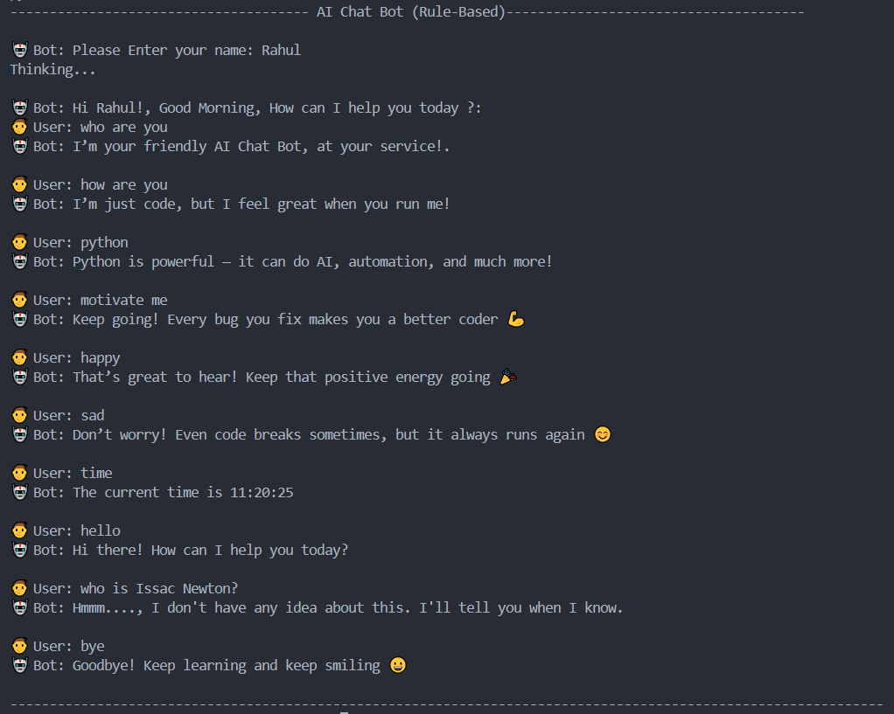

# AI Chat Bot – Rule-Based Chat Assistant in Python 🤖

## Objective
To create a conversational assistant using Python’s core logic - string matching, functions, dictionaries, and loops. 

## Key Features
- Keyword-based intent recognition
- Dynamic responses using dictionaries
- Modular function design
- Expandable to API-based real AI 

## Project Screenshot

## Future Scope
Integration with NLP APIs, Text-to-Speech, and Voice Recognition for full AI assistant behavior.